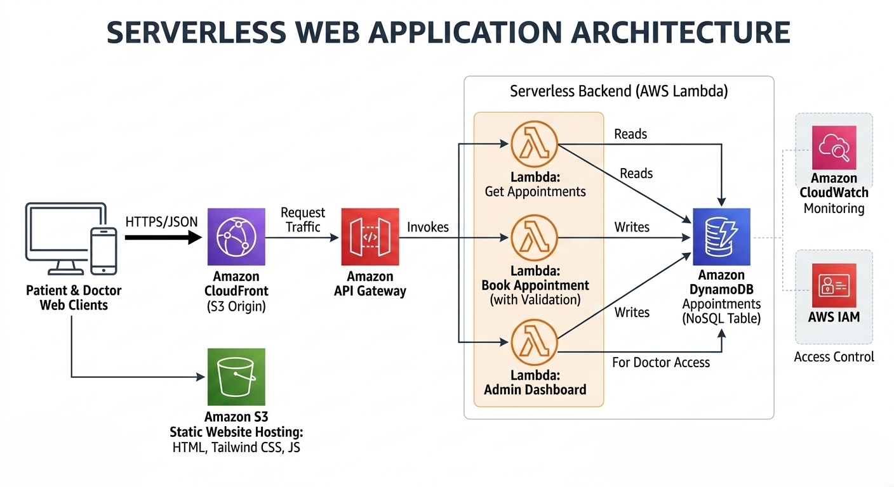

# 🦷 Sistema de Gestión de Turnos Odontológicos (MVP Serverless Ready)

Este proyecto es un Producto Mínimo Viable (MVP) desarrollado en **Node.js** y **Express** para la gestión autónoma de citas de un centro odontológico con dos profesionales independientes. El sistema simula localmente una arquitectura de microservicios y bases de datos NoSQL, estando 100% preparado para una migración directa hacia la nube de **AWS**.

---

## 🚀 Arquitectura y Lógica de Negocio

La aplicación fue diseñada siguiendo las reglas operativas reales del consultorio:
* **Capacidad:** Dos consultorios privados en paralelo (Doctora A - Ortodoncia y Doctora B - Odontología General). Permite atención simultánea sin colisión de horarios.
* **Disponibilidad:** Bloques de horarios fijos y continuos de **20 minutos** entre las 09:00 y las 18:00 hs.
* **Seguridad y Validación:** El backend centraliza las reglas de negocio limpiando espacios en blanco (`.trim()`) y validando que el DNI sea estrictamente numérico (longitud entre 7 y 9 dígitos) mediante expresiones regulares antes de persistir los datos.

### 🗺️ Simulación Cloud (Local to AWS Roadmap)

El backend modular se estructuró pensando en componentes Serverless desacoplados:

| Componente Local | Equivalente en AWS Production | Función |
| :--- | :--- | :--- |
| `server.js` (Rutas) | **AWS Lambda** + **API Gateway** | Microservicios independientes para procesamiento de peticiones. |
| `turnos.json` | **Amazon DynamoDB** (NoSQL) | Persistencia eficiente estructurada por Clave de Partición (`FECHA#YYYY-MM-DD`) y Clave de Ordenación (`DOCTORA#ID#HORA`). |
| `public/` | **Amazon S3** + **CloudFront** | Alojamiento estático seguro y de ultra baja latencia para el Frontend. |

---

## 📦 Estructura del Repositorio

```text
📂 consultorio-odontologico
 ┣ 📂 public
 ┃ ┣ 📄 index.html      # Interfaz interactiva del Paciente (Tailwind CSS)
 ┃ ┗ 📄 admin.html      # Panel privado de Gestión Médica (Dashboard)
 ┣ 📄 .gitignore        # Exclusión de dependencias locales (node_modules)
 ┣ 📄 server.js         # Servidor Express (Lógica de las funciones Lambda y validaciones)
 ┣ 📄 turnos.json       # Base de datos simulada NoSQL
 ┗ 📄 package.json      # Inventario de dependencias de Node.js


### 📊 Diagrama de Arquitectura Cloud

